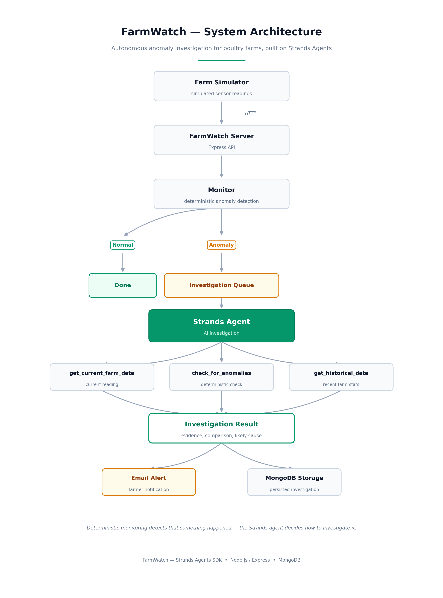

# 🐔 FarmWatch
live link: https://farmwatch-eight.vercel.app
**Autonomous AI monitoring for poultry farms using Strands Agents**

**TRACK**: Professional Agents

FarmWatch is an AI-powered background monitoring agent for poultry farms.

Instead of requiring farmers to continuously monitor dashboards, inspect sensor readings, or manually investigate abnormal measurements, FarmWatch watches incoming farm data, detects meaningful anomalies, investigates them using an AI agent, compares the abnormal reading against historical farm data, and alerts the farmer when human attention may be required.

The goal is simple:

> **Let the farm operate normally in the background, while FarmWatch investigates unusual conditions and only interrupts the farmer when something needs attention.**

FarmWatch is built around the **Strands Agents SDK**, with a simulated farm sensor system providing the incoming farm data.

---

## 🎯 Problem

Poultry farms continuously generate operational data such as:

- Water consumption
- Feed consumption
- Temperature
- Egg production

The challenge is that farmers cannot realistically watch every metric continuously.

A small abnormality may be easy to miss when someone is managing multiple houses, farms, workers, and operational tasks.

Traditional monitoring systems often provide dashboards or threshold alerts, but an alert alone does not answer important questions:

- Is this actually abnormal?
- How abnormal is it?
- Is it different from recent farm behavior?
- What evidence supports the alert?
- Does the farmer actually need to investigate it?

FarmWatch is designed to move beyond simply saying:

> "Water consumption is low."

Instead, it investigates the situation and provides a concise explanation based on available farm data.

---

# 💡 Solution

FarmWatch continuously receives farm readings and follows an agentic investigation workflow.

```text
Farm Sensor / Simulator
          │
          ▼
    FarmWatch Server
          │
          ▼
 Deterministic Anomaly
      Detection
          │
     ┌────┴────┐
     │         │
   Normal   Anomaly
     │         │
     ▼         ▼
    Done   Investigation
               │
               ▼
        Strands Agent
               │
       ┌───────┼────────┐
       ▼       ▼        ▼
    Current  Anomaly  Historical
      Data    Check      Data
       │       │        │
       └───────┼────────┘
               ▼
        Investigation
           Result
               │
               ▼
        Farmer Alert
```

The important distinction is that **anomaly detection and investigation are separate**.

The deterministic monitoring layer identifies that something unusual has happened.

The Strands agent then decides how to investigate the anomaly using its available tools.

---

# 🧠 Agentic Workflow

When a farm reading arrives, FarmWatch follows this workflow.

### 1. Receive farm data

The farm simulator generates readings representing sensor data from a poultry house.

Example:

```json
{
  "farmId": "farm-001",
  "houseId": "house-01",
  "timestamp": "2026-09-11T10:00:00.000Z",
  "temperatureC": 28.1,
  "waterLiters": 42.4,
  "feedKg": 41.8,
  "eggCount": 409
}
```

---

### 2. Detect anomalies

FarmWatch compares the incoming reading against the configured farm baseline.

Current baseline:

```text
Water:       80 L
Feed:        42 kg
Eggs:        410
Temperature: 28 °C
```

Anomalies are detected using deterministic thresholds.

For example:

- Water deviation ≥ 20% → anomaly
- Feed deviation ≥ 20% → anomaly
- Egg production deviation ≥ 15% → anomaly
- Temperature deviation ≥ 3°C → anomaly

Severity increases when the deviation becomes larger.

---

### 3. Investigate anomalies with Strands

When an anomaly is detected, FarmWatch creates an investigation job.

The Strands agent receives the farm reading and uses tools to investigate it.

The agent is instructed to follow this sequence:

```text
get_current_farm_data
        ↓
check_for_anomalies
        ↓
     anomaly?
      /     \
    no       yes
    │         │
    ▼         ▼
  Stop   get_historical_data
              │
              ▼
       Produce investigation
```

The agent is explicitly instructed not to invent information that is not provided by its tools.

---

## Architecture

FarmWatch uses a background monitoring pipeline where farm sensor
readings are analyzed for anomalies and investigated by a Strands agent.

## 

# 🛠️ Agent Tools

FarmWatch currently provides the Strands agent with three tools.

### `get_current_farm_data`

Returns the current farm reading.

The data includes:

- Farm ID
- House ID
- Timestamp
- Temperature
- Water consumption
- Feed consumption
- Egg production

---

### `check_for_anomalies`

Runs FarmWatch's deterministic anomaly detector.

The tool returns:

- Whether the farm is normal or anomalous
- Which metrics are abnormal
- Current values
- Baseline values
- Percentage deviation
- Severity

The agent is instructed to use this tool rather than calculating anomaly severity itself.

---

### `get_historical_data`

Returns statistics calculated from recent farm readings.

The tool provides:

- Sample size
- Average
- Minimum
- Maximum

for:

- Water
- Feed
- Egg production
- Temperature

The agent uses this information to compare the current anomaly against recent farm behavior.

---

# 🔎 Example Investigation

Suppose the normal water consumption for a house is approximately:

```text
80 L
```

The farm simulator produces:

```text
42 L
```

FarmWatch detects:

```text
Water consumption:
42 L

Baseline:
80 L

Deviation:
-47.5%

Severity:
High
```

The anomaly triggers an investigation.

The Strands agent then:

```text
1. Retrieves the current reading
2. Confirms the anomaly
3. Retrieves recent historical readings
4. Compares the current reading with historical data
5. Produces a structured investigation result
```

The final investigation contains:

```text
Finding:
What anomaly was detected.

Evidence:
Facts directly supported by farm data.

Historical comparison:
How the current reading compares with recent readings.

Likely explanation:
A possible explanation only when supported by
the available evidence.
```

If the available information is insufficient to determine the cause, FarmWatch explicitly reports that rather than inventing a cause.

---

# 🏗️ Architecture

```text
                         ┌──────────────────────┐
                         │   Farm Simulator     │
                         │                      │
                         │ Simulated sensor     │
                         │ readings             │
                         └──────────┬───────────┘
                                    │
                                    │ HTTP
                                    ▼
                         ┌──────────────────────┐
                         │  FarmWatch Server    │
                         │                      │
                         │ Express API          │
                         └──────────┬───────────┘
                                    │
                                    ▼
                         ┌──────────────────────┐
                         │     Monitor          │
                         │                      │
                         │ Deterministic        │
                         │ anomaly detection    │
                         └──────────┬───────────┘
                                    │
                         ┌──────────┴──────────┐
                         │                     │
                      Normal                Anomaly
                         │                     │
                         ▼                     ▼
                       Done            Investigation Queue
                                               │
                                               ▼
                                      ┌──────────────────┐
                                      │  Strands Agent   │
                                      │                  │
                                      │  AI investigation│
                                      └────────┬─────────┘
                                               │
                         ┌─────────────────────┼─────────────────────┐
                         │                     │                     │
                         ▼                     ▼                     ▼
                  Current Data         Anomaly Check          Historical Data
                      Tool                  Tool                    Tool
                         │                     │                     │
                         └─────────────────────┼─────────────────────┘
                                               │
                                               ▼
                                      Investigation Result
                                               │
                              ┌────────────────┴───────────────┐
                              │                                │
                              ▼                                ▼
                         Email Alert                    MongoDB Storage
```

---

# 📁 Project Structure

```text
farmwatch/
│
├── farm-simulator/
│   ├── src/
│   │   ├── types/
│   │   │   └── types.ts
│   │   ├── server.ts
│   │   ├── simulator.ts
│   │   └── test-simulator.ts
│   │
│   ├── package.json
│   └── tsconfig.json
│
├── farmwatch-server/
│   ├── src/
│   │   ├── database/
│   │   │   └── mongodb.ts
│   │   │
│   │   ├── mail/
│   │   │   └── send_mail.ts
│   │   │
│   │   ├── queue/
│   │   │   └── investigationQueue.ts
│   │   │
│   │   ├── repository/
│   │   │   └── investigationRepository.ts
│   │   │
│   │   ├── schemas/
│   │   │   └── agent_findings.ts
│   │   │
│   │   ├── tools/
│   │   │   ├── check_for_anomalies.ts
│   │   │   ├── detect_anomaly.ts
│   │   │   ├── get-current-farm-data.ts
│   │   │   └── get-historical-data.ts
│   │   │
│   │   ├── types/
│   │   │   └── types.ts
│   │   │
│   │   ├── agent.ts
│   │   ├── monitor.ts
│   │   └── server.ts
│   │
│   ├── package.json
│   └── tsconfig.json
│
├── frontend/
│   ├── farmwatch-dashboard.html
│   └── farmwatch-simulator.html
│
├── Architecture.md
├── PHASES.md
├── package.json
└── package-lock.json
```

---

# 🧩 Components

## Farm Simulator

The `farm-simulator` package simulates readings that would normally come from real farm sensors.

It generates:

- Temperature
- Water consumption
- Feed consumption
- Egg production

The simulator supports different farm scenarios:

```text
normal
water_system_issue
feed_system_issue
production_drop
heat_stress
```

This makes it possible to demonstrate FarmWatch without requiring physical sensors.

The simulator exposes an HTTP API that can also be used to manually trigger specific scenarios.

---

## FarmWatch Server

The `farmwatch-server` package contains the main FarmWatch monitoring and agent logic.

Responsibilities include:

- Receiving farm readings
- Detecting anomalies
- Storing readings
- Queueing investigations
- Running the Strands agent
- Sending investigation alerts
- Persisting investigation results

---

## Monitoring Layer

`monitor.ts` receives farm readings and runs deterministic anomaly detection.

Normal readings are simply recorded.

When an anomaly is detected, an investigation is queued.

This separation prevents the LLM from being responsible for the initial numerical threshold detection.

---

## Investigation Queue

`investigationQueue.ts` provides a lightweight in-process investigation queue.

When an anomaly is detected:

```text
Farm Reading
     │
     ▼
Anomaly
     │
     ▼
Queue Investigation
     │
     ▼
Run Strands Agent
     │
     ▼
Send Alert
     │
     ▼
Save Investigation
```

This allows the monitoring endpoint to acknowledge the farm reading without directly performing the potentially slower AI investigation.

---

# 🤖 Strands Agents SDK

FarmWatch uses the **Strands Agents SDK** to implement the investigation agent.

The agent is created with:

- A system prompt
- An LLM model
- FarmWatch tools
- A structured output schema

The agent's system prompt enforces an evidence-based investigation workflow.

For example, the agent is instructed:

```text
Never invent facts.

Never assume information that was not returned by a tool.

Never claim to have checked something unless
the relevant tool was actually called.

If the available data is insufficient to determine
a cause, explicitly state that the cause is uncertain.
```

This is important because FarmWatch is intended to assist with operational decisions rather than simply generate plausible-sounding explanations.

---

# 📦 Tech Stack

| Component           | Technology                       |
| ------------------- | -------------------------------- |
| Language            | TypeScript                       |
| Agent framework     | Strands Agents SDK               |
| Model interface     | OpenAI-compatible model endpoint |
| Model provider      | Groq                             |
| Backend             | Node.js + Express                |
| Farm simulation     | Custom TypeScript simulator      |
| Database            | MongoDB                          |
| Email notifications | SMTP / configured mail service   |
| Frontend            | HTML                             |
| API communication   | HTTP / JSON                      |

---

# 🚀 Getting Started

## Prerequisites

You will need:

- Node.js 18+
- npm
- MongoDB
- A model API key compatible with the configured Strands model
- Git

Clone the repository:

```bash
git clone https://github.com/DOOMSDAY101/farmwatch.git

cd farmwatch
```

Install root dependencies:

```bash
npm install
```

Install FarmWatch server dependencies:

```bash
cd farmwatch-server
npm install
```

Install simulator dependencies:

```bash
cd ../farm-simulator
npm install
```

Return to the project root:

```bash
cd ..
```

---

# 🔐 Environment Variables

The FarmWatch server requires environment variables for the model and external services.

Create:

```text
farmwatch-server/.env
```

Example:

```env
GROQ_API_KEY=your_groq_api_key

MONGODB_URI=your_mongodb_connection_string

# Configure according to your email provider
SMTP_HOST=your_smtp_host
SMTP_PORT=587
SMTP_USER=your_smtp_username
SMTP_PASSWORD=your_smtp_password
MAIL_FROM=your_sender_email
MAIL_TO=your_recipient_email
```

The farm simulator can optionally be configured with:

```env
PORT=4000

FARMWATCH_WEBHOOK_URL=http://localhost:3000/webhook/farm-data

SIMULATION_INTERVAL_MS=3600000
```

Do **not** commit `.env` files or API keys to the repository.

---

# ▶️ Running FarmWatch

From the project root:

```bash
npm run dev
```

This starts both:

```text
FarmWatch Server → http://localhost:3000

Farm Simulator  → http://localhost:4000
```

The simulator immediately generates a reading and sends it to FarmWatch.

After that, it continues generating readings according to the configured simulation interval.

---

# 🧪 Testing an Anomaly

The simulator exposes a manual scenario endpoint.

You can send a simulated abnormal reading directly to:

```text
POST http://localhost:4000/simulation/event
```

Example:

```json
{
  "event": "water_system_issue",
  "reading": {
    "farmId": "farm-001",
    "houseId": "house-01",
    "timestamp": "2026-09-11T10:00:00.000Z",
    "temperatureC": 28,
    "waterLiters": 42,
    "feedKg": 42,
    "eggCount": 410
  }
}
```

FarmWatch should identify the abnormal water consumption and queue an investigation.

The investigation is then handled by the Strands agent.

---

# 🔌 API Endpoints

## Farm Simulator

### Health

```http
GET /health
```

Returns the simulator status.

---

### Trigger Simulation Event

```http
POST /simulation/event
```

Manually sends a farm event to FarmWatch.

Supported events:

```text
normal
water_system_issue
feed_system_issue
production_drop
heat_stress
```

---

## FarmWatch Server

### Health

```http
GET /health
```

Returns:

```json
{
  "status": "ok",
  "service": "farmwatch-server"
}
```

---

### Farm Data Webhook

```http
POST /webhook/farm-data
```

Receives farm sensor readings.

This endpoint:

1. Validates the reading
2. Runs anomaly detection
3. Stores the reading
4. Queues an investigation when necessary
5. Returns the detection result

---

### Get Readings

```http
GET /readings
```

Returns farm readings currently held by the monitoring process.

---

### Get Investigations

```http
GET /api/investigations
```

Returns stored FarmWatch investigations.

---

# 📊 Anomaly Detection

FarmWatch currently uses a deterministic baseline-based anomaly detector.

## Water

Baseline:

```text
80 L
```

Anomaly threshold:

```text
20% deviation
```

High severity:

```text
40% deviation
```

---

## Feed

Baseline:

```text
42 kg
```

Anomaly threshold:

```text
20% deviation
```

High severity:

```text
40% deviation
```

---

## Egg Production

Baseline:

```text
410 eggs
```

Anomaly threshold:

```text
15% deviation
```

High severity:

```text
30% deviation
```

---

## Temperature

Baseline:

```text
28°C
```

Anomaly threshold:

```text
3°C difference
```

High severity:

```text
5°C difference
```

These thresholds are currently configured in:

```text
farmwatch-server/src/tools/detect_anomaly.ts
```

---

# 🧑‍🌾 Human-in-the-Loop

FarmWatch is designed around the idea that an AI agent should **assist the farmer rather than silently make operational decisions**.

The current workflow is:

```text
Farm data
    ↓
Anomaly detected
    ↓
AI investigation
    ↓
Evidence-based finding
    ↓
Farmer notification
    ↓
Human decision
```

The system can identify situations that deserve attention, but the farmer remains responsible for deciding what action should actually be taken.

---

# 🛡️ Evidence-Based Agent Design

FarmWatch deliberately separates deterministic monitoring from AI reasoning.

The anomaly detector performs numerical threshold checks.

The AI agent is responsible for:

- Investigating the anomaly
- Calling relevant tools
- Comparing current data with historical data
- Summarizing evidence
- Explaining uncertainty

The agent is explicitly instructed not to fabricate information.

For example, if FarmWatch only has evidence that water consumption decreased, the agent should not automatically claim:

> "The water pump has failed."

Instead, it should report that the available data is insufficient to determine the exact cause.

This makes the agent's output more appropriate for real operational monitoring.

---

# 🗄️ Data Persistence

FarmWatch uses MongoDB to persist completed investigation records.

An investigation contains information such as:

- Farm ID
- House ID
- Detection timestamp
- Original farm reading
- Detected anomalies
- AI finding
- Evidence
- Historical comparison
- Likely explanation
- Severity
- Human attention recommendation

This provides a record of investigations that can later be used for auditing, analysis, or a future farm monitoring dashboard.

---

# 🖥️ Frontend

The repository also contains lightweight HTML interfaces under:

```text
frontend/
```

These interfaces are intended to help demonstrate the FarmWatch monitoring workflow and simulation.

The core FarmWatch functionality does not depend on the frontend.

The backend API and farm simulator can operate independently.

---

# 🔄 End-to-End Example

A typical FarmWatch event looks like this:

```text
1. Farm simulator generates a reading

        ↓

2. FarmWatch receives the reading

        ↓

3. Deterministic anomaly detector checks
   water, feed, eggs and temperature

        ↓

4. Reading is normal

        └── FarmWatch records it and does nothing

OR

4. Anomaly detected

        ↓

5. Investigation is added to the queue

        ↓

6. Strands agent starts investigation

        ↓

7. Agent calls get_current_farm_data

        ↓

8. Agent calls check_for_anomalies

        ↓

9. Agent calls get_historical_data

        ↓

10. Agent compares current and historical data

        ↓

11. Structured investigation result generated

        ↓

12. Farmer receives an alert

        ↓

13. Investigation is persisted in MongoDB
```

---

# 🎯 Hackathon Focus

FarmWatch was built around the idea of an **autonomous background agent**.

The agent is not simply a chatbot waiting for a farmer to ask a question.

Instead:

```text
Farm activity
     ↓
Background monitoring
     ↓
Anomaly
     ↓
Autonomous investigation
     ↓
Human notification
```

The farmer does not need to manually ask:

> "Is anything wrong with the farm?"

FarmWatch proactively investigates unusual conditions and brings the result to the farmer.

---

# 🛣️ Future Improvements

The current implementation is intentionally focused on demonstrating the core agentic workflow.

Potential future improvements include:

### Real sensor integration

Replace the simulated farm readings with data from:

- Water meters
- Feed systems
- Temperature sensors
- Egg collection systems

### Weather intelligence

Add a weather tool so the agent can investigate whether external weather conditions could explain anomalies.

### More farm context

Additional tools could provide:

- Equipment status
- Maintenance history
- Farm events
- Animal health information
- Worker activity
- Feed deliveries

### Human approval workflow

Extend the notification system so farmers can explicitly:

```text
Approve
Reject
Request more information
```

before an operational task is created.

### Multi-house monitoring

Expand the system from one simulated poultry house to multiple houses and farms.

### Production deployment

Deploy the monitoring and agent infrastructure to AWS and integrate with managed services for production-scale operation.

---

# ⚠️ Current Limitations

FarmWatch is currently a hackathon prototype.

The farm sensor data is simulated rather than collected from physical farm equipment.

The anomaly baselines and thresholds are currently configured values rather than learned from a production farm.

The investigation queue is an in-process queue and is therefore not designed for distributed production workloads.

The historical data available to the agent is limited to readings maintained by the current application process.

The agent's conclusions are limited to the information exposed through its tools.

These limitations are intentional for the prototype and provide clear areas for future development.

---

# 🔒 Security

Never commit secrets to the repository.

The following should remain private:

- API keys
- Database credentials
- SMTP credentials
- Authentication tokens
- `.env` files

Use environment variables for secrets.

---

# 📜 License

This project is licensed under the **MIT License**.

See the `LICENSE` file for details.

---

# 👨‍💻 Author

**IFEOLUWA**

FarmWatch was built as a hackathon project exploring autonomous AI agents for repetitive operational monitoring.

---

# ⭐ Project Summary

FarmWatch turns raw poultry farm readings into an autonomous monitoring workflow:

```text
Monitor
   ↓
Detect
   ↓
Investigate
   ↓
Explain
   ↓
Notify
```

Instead of forcing farmers to continuously monitor operational data, FarmWatch watches in the background and brings meaningful anomalies to their attention.

**The goal is not to replace the farmer.**

**The goal is to make sure the farmer only has to pay attention when attention is actually needed.**
